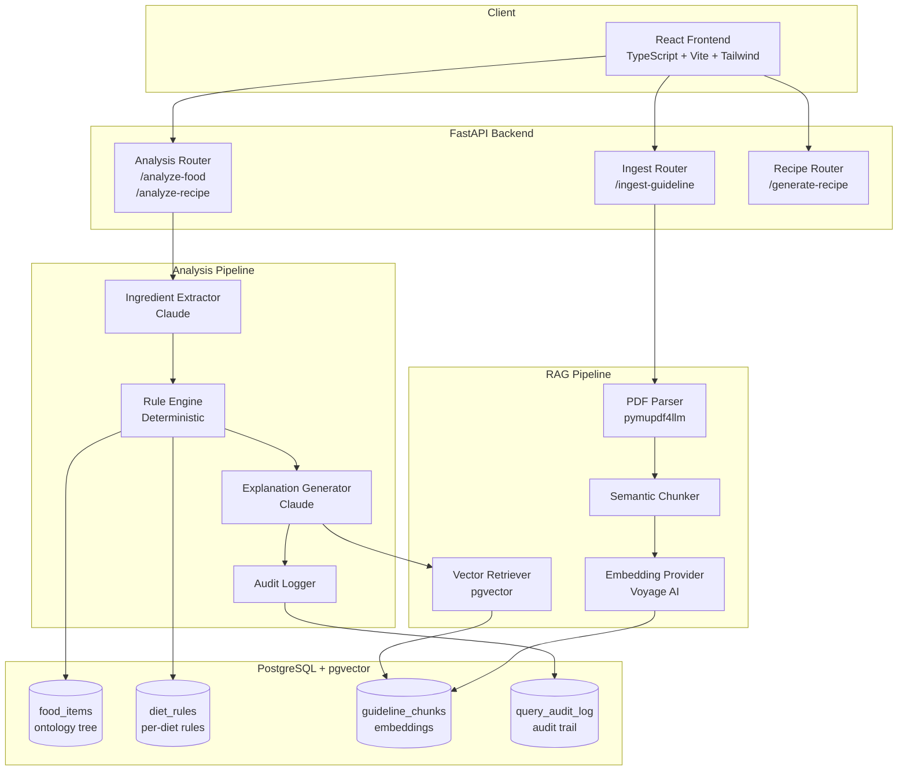
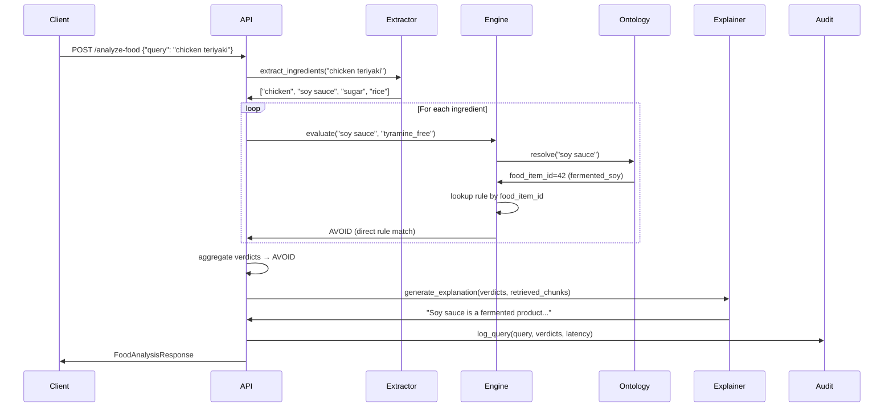
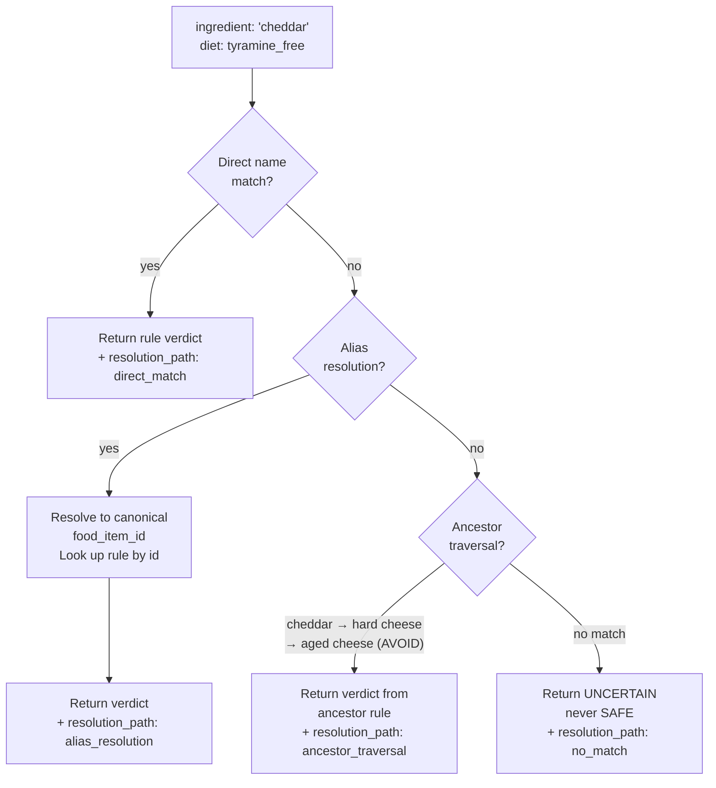
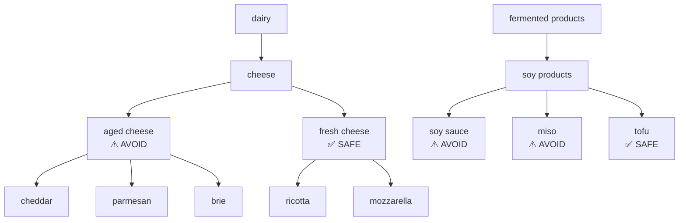
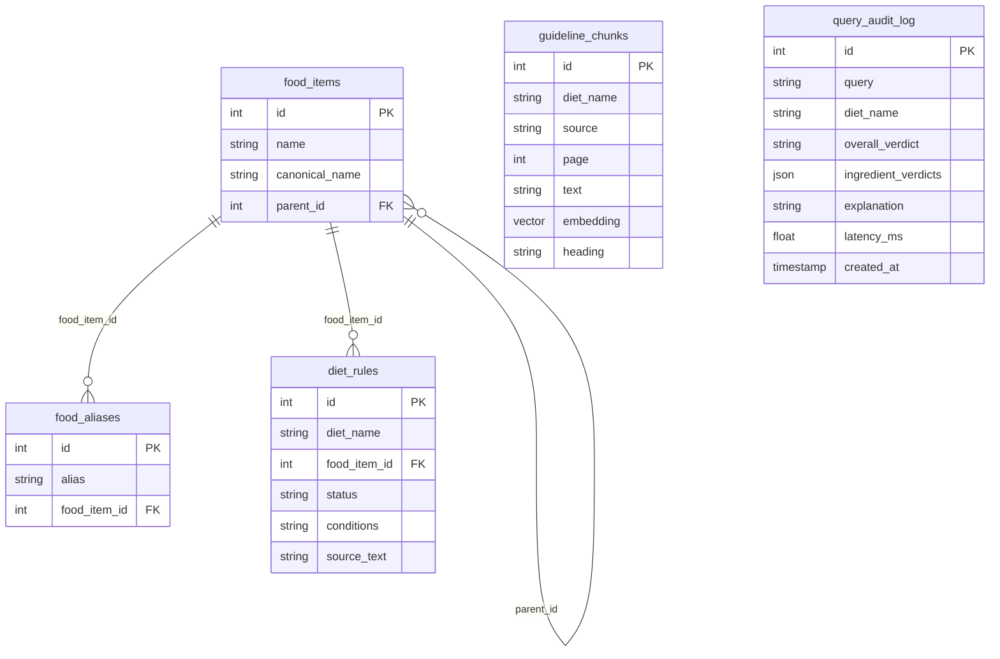
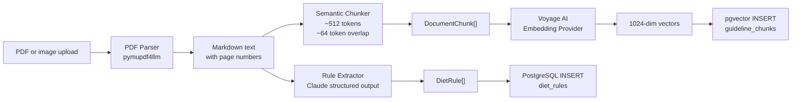

# Architecture

## System Overview



---

## Analysis Pipeline — Detailed



---

## Rule Engine Resolution



---

## Food Ontology Tree (partial)



---

## Database Schema



---

## Verdict Priority

```
AVOID (3)  >  CAUTION (2)  >  UNCERTAIN (1)  >  SAFE (0)
```

Meal verdict = max(ingredient verdicts). One AVOID ingredient = AVOID meal.
Unknown ingredients always return UNCERTAIN, never SAFE.

---

## Ingest Pipeline


